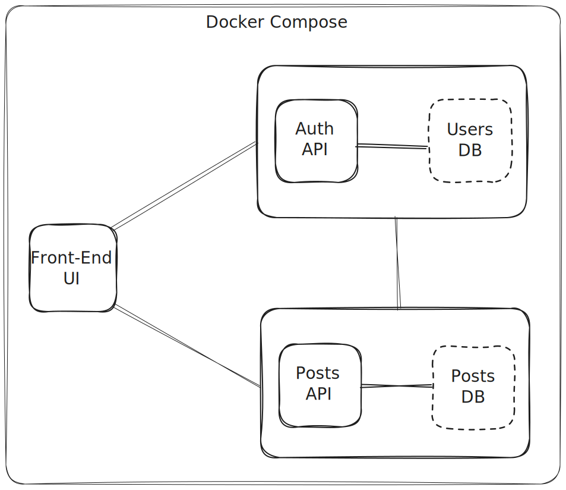
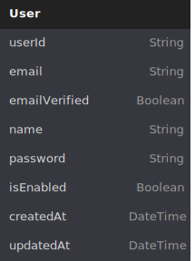
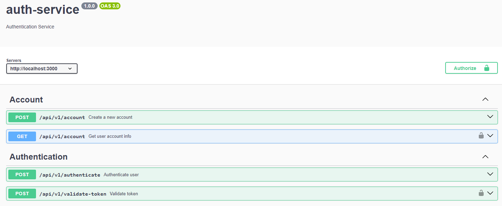
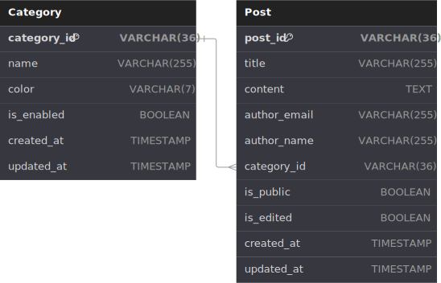
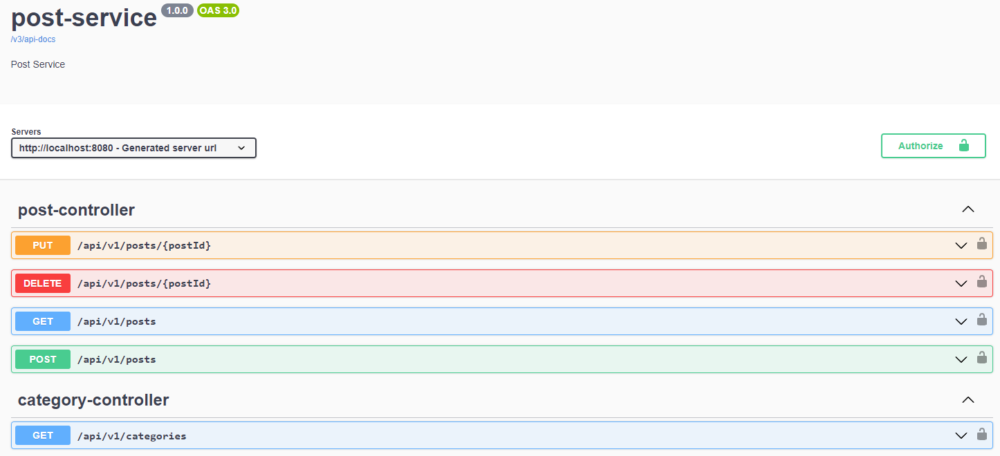
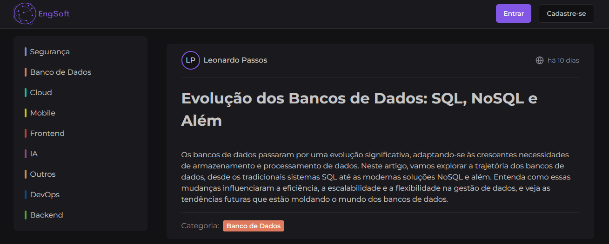
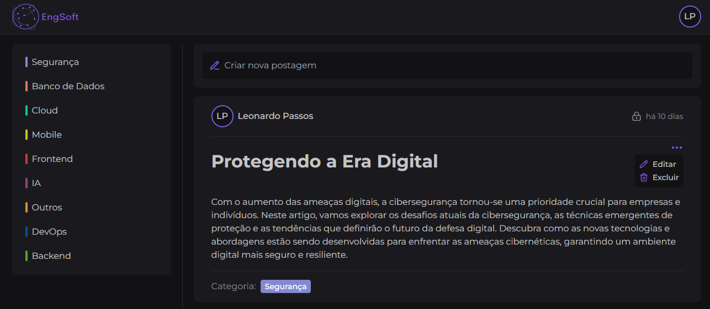
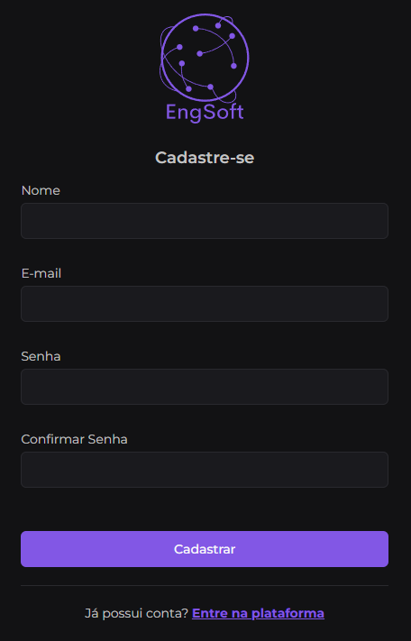
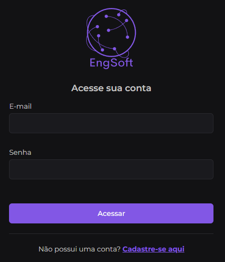

# Vídeo 
https://www.youtube.com/watch?v=qP13OdOkPdA

# Índice

1. [Sobre o Projeto](#sobre-o-projeto)
2. [Disposição dos Microsserviços](#disposição-dos-microsserviços)
3. [Executando o Projeto](#executando-o-projeto)
   - [Clonar o Repositório](#clonar-o-repositório)
   - [Acessar o Diretório do Projeto](#acessar-o-diretório-do-projeto)
   - [Inicializar os Containers](#inicializar-os-containers)
   - [Verificar os Containers](#verificar-os-containers)
   - [Acessar a Aplicação](#acessar-a-aplicação)
4. [Gerenciamento de Usuários e Autenticação (Auth API)](#gerenciamento-de-usuários-e-autenticação-auth-api)
   - [Tecnologias Utilizadas](#tecnologias-utilizadas)
   - [Critérios de Aceitação](#critérios-de-aceitação)
   - [Modelo de Dados](#modelo-de-dados)
   - [Documentação da API](#documentação-da-api)
5. [Gerenciamento de Postagens (Posts API)](#gerenciamento-de-postagens-posts-api)
   - [Tecnologias Utilizadas](#tecnologias-utilizadas-1)
   - [Critérios de Aceitação](#critérios-de-aceitação-1)
   - [Permissionamento](#permissionamento)
   - [Modelo de Dados](#modelo-de-dados-1)
   - [Documentação da API](#documentação-da-api-1)
6. [Front-End](#front-end)
   - [Tecnologias Utilizadas](#tecnologias-utilizadas-2)
   - [Critérios de Aceitação](#critérios-de-aceitação-2)
   - [Telas](#telas)
7. [Contribuidores](#contribuidores)
8. [Orientadores](#orientadores)
9. [Licença](#licença)

## Sobre o Projeto

O projeto **EngSoft** é uma aplicação desenvolvida como parte da disciplina de Engenharia de Software I do curso de Análise e Desenvolvimento de Sistemas pelo Instituto Federal do Rio Grande do Sul. O objetivo principal deste trabalho é demonstrar a criação de uma aplicação distribuída utilizando a arquitetura de microsserviços, containerizada com Docker.

A aplicação desenvolvida é um blog voltado para postagens sobre assuntos relacionados à Tecnologia da Informação. Para isso, o blog foi dividido em três microsserviços, cada um responsável por uma parte específica da aplicação:

- **Gerenciamento de Usuários e Autenticação**: Este microsserviço, desenvolvido em Node.js com um banco de dados PostgreSQL, é responsável pelo cadastro e autenticação dos usuários, bem como pela validação das sessões.

- **Gerenciamento de Postagens**: Utilizando Java e MySQL, este microsserviço cuida da criação, edição, exclusão e categorização das postagens no blog.

- **Front-End**: A interface do usuário foi construída com Next.js, proporcionando uma experiência de usuário moderna e eficiente.

A abordagem de microsserviços permite uma escalabilidade e manutenção mais fácil da aplicação, facilitando o desenvolvimento e a integração contínua. Ao utilizar Docker para containerização, asseguramos um ambiente de desenvolvimento e produção consistente e eficiente.

O desenvolvimento deste projeto envolveu a utilização de diversas tecnologias e práticas modernas, refletindo as demandas atuais do mercado de Tecnologia da Informação. Esta documentação visa detalhar a implementação, arquitetura, e as decisões técnicas que guiaram o desenvolvimento do EngSoft, proporcionando uma visão abrangente sobre como construir uma aplicação robusta e escalável utilizando microsserviços.

### Disposição dos Microsserviços



## Executando o Projeto

### 1. Clonar o Repositório

Clone o repositório usando o seguinte comando:

```
 git clone https://github.com/passosleo/blog-engsoft.git
```

### 2. Acessar o Diretório do Projeto

Após clonar o repositório, navegue até o diretório do projeto:

```
cd blog-engsoft
```

### 3. Inicializar os Containers

Execute o seguinte comando para criar e iniciar os containers do Docker Compose:

```
docker-compose up -d
```

### 5. Verificar os Containers

Verifique se os containers foram criados e estão em execução:

```
docker ps
```

### 6. Acessar a Aplicação

Após iniciar os containers, a aplicação estará disponível no seguinte endereço:

```
http://localhost:8000
```

## Gerenciamento de Usuários e Autenticação (Auth API)

Microsserviço responsável pelo cadastro e autenticação de usuários, bem como pela validação das sessões utilizando o padrão JWT.

### Tecnologias Utilizadas

- **TypeScript**: Superset de JavaScript que adiciona tipagem estática ao código.
- **Node.js**: Plataforma de desenvolvimento de aplicações em JavaScript.
- **Express**: Framework web para Node.js.
- **PostgreSQL**: Banco de dados relacional.
- **Prisma**: ORM para Node.js.
- **JSON Web Token (JWT)**: Padrão aberto que define uma maneira compacta e autocontida para transmitir informações entre as partes como um objeto JSON.
- **Swagger**: Framework para documentação de APIs REST.
- **Docker**: Plataforma para desenvolvimento, envio e execução de aplicações em contêineres.

### Critérios de aceitação

1. Deve possuir um banco de dados PostgreSQL para armazenar os dados dos usuários.
2. Deve permitir o cadastro de usuários com nome, e-mail e senha.
3. Deve permitir a autenticação de usuários.
4. Deve permitir a validação de sessões de usuários autenticados.
5. Deve possuir uma rota para obter os dados de um usuário autenticado.
6. Deve armazenar as senhas dos usuários de forma segura.
7. Deve possuir uma API REST documentada com Swagger.
8. Não deve permitir o acesso a rotas protegidas sem autenticação.
9. Não deve permitir o cadastro de usuários com e-mails duplicados.

### Modelo de Dados

O modelo de dados do microsserviço de gerenciamento de usuários e autenticação é composto por uma única entidade: `User`.



### Documentação da API

A documentação foi gerada utilizando o Swagger. Para acessar, basta iniciar o microsserviço acessar a rota `/api/v1/docs`.



## Gerenciamento de Postagens (Posts API)

Microsserviço responsável pelo cadastro e gerenciamento de postagens no blog, incluindo a categorização das postagens.

### Tecnologias Utilizadas

- **Java**: Linguagem de programação de propósito geral.
- **Spring Boot**: Framework para criação de aplicações Java.
- **MySQL**: Banco de dados relacional.
- **Flyway**: Ferramenta para controle de versão de banco de dados.
- **Hibernate**: ORM para Java.
- **Swagger**: Framework para documentação de APIs REST.
- **Docker**: Plataforma para desenvolvimento, envio e execução de aplicações em contêineres.

### Critérios de aceitação

1. Cada postagem deve possuir um título, conteúdo (incluindo HTML), autor, categoria e data de criação.
2. Deve fornecer rotas para criar, editar, excluir e listar postagens.
3. Deve permitir visitantes visualizarem as postagens públicas.
4. Deve permitir a categorização das postagens.
5. Deve permitir a paginação e busca de postagens por categoria.
6. Deve mostrar a postagem como editada caso a data de edição seja posterior à data de criação.
7. Deve possuir uma API REST documentada com Swagger.
8. Não deve permitir o acesso a rotas protegidas sem autenticação.

### Permissionamento

O microsserviço de gerenciamento de postagens possui as seguintes permissões para usuários autenticados e visitantes:

<table border="1">
  <tr>
    <th>Ações</th>
    <th style="text-align:center">usuário<br>sim</th>
    <th style="text-align:center">usuário<br>não</th>
    <th style="text-align:center">visitante<br>sim</th>
    <th style="text-align:center">visitante<br>não</th>
  </tr>
  <tr>
    <td>visualizar as postagens públicas</td>
    <td style="text-align:center">X</td>
    <td></td>
    <td style="text-align:center">X</td>
    <td></td>
  </tr>
  <tr>
    <td>visualizar postagens privadas</td>
    <td style="text-align:center">X</td>
    <td></td>
    <td></td>
    <td style="text-align:center">X</td>
  </tr>
  <tr>
    <td>criar uma nova postagem</td>
    <td style="text-align:center">X</td>
    <td></td>
    <td></td>
    <td style="text-align:center">X</td>
  </tr>
  <tr>
    <td>editar postagens próprias</td>
    <td style="text-align:center">X</td>
    <td></td>
    <td></td>
    <td style="text-align:center">X</td>
  </tr>
  <tr>
    <td>editar postagens de terceiros</td>
    <td></td>
    <td style="text-align:center">X</td>
    <td></td>
    <td style="text-align:center">X</td>
  </tr>
  <tr>
    <td>deletar postagens próprias</td>
    <td style="text-align:center">X</td>
    <td></td>
    <td></td>
    <td style="text-align:center">X</td>
  </tr>
  <tr>
    <td>deletar postagens de terceiros</td>
    <td></td>
    <td style="text-align:center">X</td>
    <td></td>
    <td style="text-align:center">X</td>
  </tr>
  <tr>
    <td>filtrar as postagens por categoria</td>
    <td style="text-align:center">X</td>
    <td></td>
    <td style="text-align:center">X</td>
    <td></td>
  </tr>
</table>

### Modelo de Dados

O modelo de dados do microsserviço de gerenciamento de postagens é composto por duas entidades: `Post` e `Category`.



### Documentação da API

A documentação foi gerada utilizando o Swagger. Para acessar, basta iniciar o microsserviço acessar a rota `/swagger-ui/index.html`.



## Front-End

Aplicação front-end desenvolvida com Next.js para proporcionar uma experiência de usuário moderna e eficiente.

### Tecnologias Utilizadas

- **TypeScript**: Superset de JavaScript que adiciona tipagem estática ao código.
- **React**: Biblioteca JavaScript para construção de interfaces de usuário.
- **Next.js**: Framework para criação de aplicações React.
- **Tailwind CSS**: Framework CSS para estilização de componentes.
- **shadcn/ui**: Biblioteca de componentes React.
- **React Hook Form**: Biblioteca para gerenciamento de formulários em React.
- **Zustand**: Biblioteca para gerenciamento de estado global em React.

### Critérios de aceitação

1. Deve permitir visitantes visualizarem as postagens públicas.
2. Deve permitir usuários autenticados visualizarem postagens privadas.
3. Deve permitir o cadastro de novos usuários.
4. Deve permitir a autenticação de usuários.
5. Deve permitir que usuários autenticados criem, editem e excluam postagens.
6. Deve permitir a filtragem de postagens por categoria.
7. Deve possuir uma interface responsiva e moderna.
8. Deve possuir uma navegação intuitiva e eficiente.
9. Deve permitir a paginação das postagens.

### Telas

#### Página Inicial (Visitante)



#### Página Inicial (Usuário Autenticado)



#### Páginas de Cadastro e Login

<div style="display:flex;align-items:start;gap:10px">


</div>

## Contribuidores

- [Leonardo Passos](https://github.com/passosleo)
- [Rayane Melo](https://github.com/rayanemelo)
- [Laisla Passos](https://github.com/passoslaisla)

## Orientadores

- [Prof. Frederico Schardong](https://github.com/fredericoschardong)

## Licença

Distribuído sob a licença MIT. Veja `LICENSE` para mais informações.
